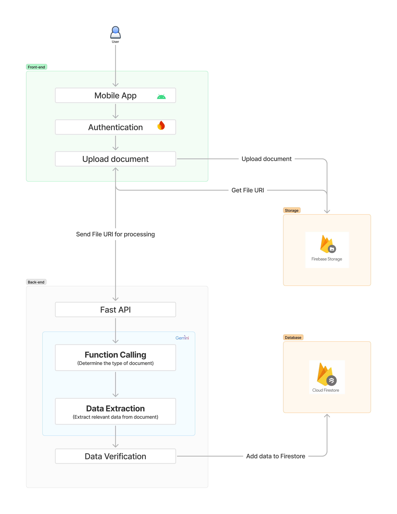

# Cronic

Cronic is an Android app that empowers low-income patients in India with instant healthcare reimbursements

## Demo

You can find the product demo [here](https://youtu.be/nTpBKH_ofCI?si=9lmeHmh7w15i9oHz)

## Description

**Cronic** is designed to help low-income patients who lack insurance coverage quickly get reimbursed for their healthcare expenses. Users simply take photos of their medical bills using their smartphone. We then use Gemini to analyze these documents. Gemini identifies the document type and extracts key information like patient name and cost. This allows us to process claims much faster than traditional methods. By dramatically reducing the waiting time for reimbursements, we are helping ensure that financial constraints don't prevent people from getting necessary medical care. 

## Testing Instructions
* Download `cronic.apk` from [here](https://drive.google.com/drive/folders/1siyn6RAnnhZ2wyuZO6PF4mnbSENqE-25?usp=sharing)
* Login with the following test credentials
	* Contact Number - 9999988888
	* OTP - 999888
* Upload the bill stored in `sample_docs` directory for testing

## App Architecture

